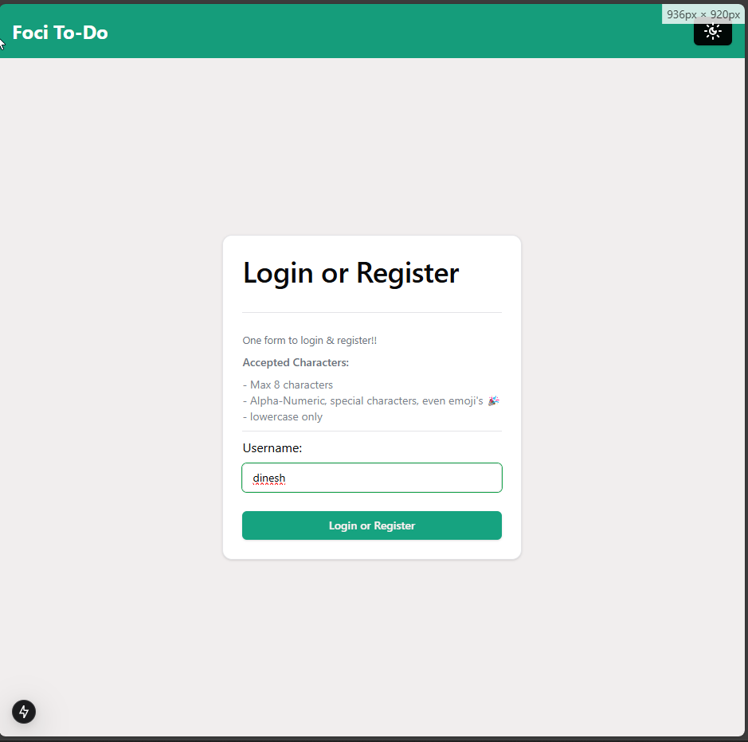

## Foci To-Do app




## Getting Started

First, run the development server:

```bash
npm run dev
# or
yarn dev
# or
pnpm dev
# or
bun dev
```

# Future Improvement

### Performance:

1. Database indexing for full text search
2. Event Driven approach to keep all tabs in Sync
3. Limit the number of API calls - merge states on client-side. Right now, each action 2 API calls (one to perform the
   action and other one to load the todo list).
4. Impl `useOptimistic(...)` to improve the loading time.

### Maintainability:

1. Add more test cases
2. Some Code Refactoring

### Error Handling

1. Improve error handling and UI/UX error messages
