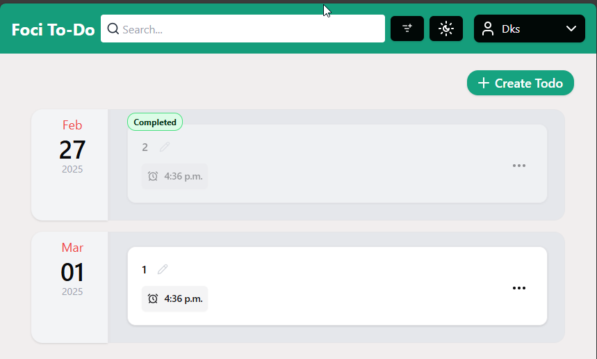

## Foci To-Do app (Multi User)

|                              |                              |                                  |
|------------------------------|------------------------------|----------------------------------|
|           |  |  |
|  |  |       |

# Requirements

- [X] Programming TypeScript (React + NextJS + PostgresSQL)
- [X] Interface - Web
- [X] Each to-do item must include the following Fields
    -  [X] Title
    -  [x] Description
    -  [X] Due Date
- [X] Functional
    - [X] Create, Read, Update, Delete, Add the ability to mark.
    - [X] Optional - Sorting todo items by due date or title
    - [X] Optional - Filtering Options  (e.g., show only complete, or in-progress items).
    - [X] Additional
        - [X] Grouping TODO by dueDate and sorting the group
        - [X] Dark and Light Mode
        - [X] Multi user support
        - [X] Advance Search functionality
- [X] Shipping - Docker-Compose Ready - To prop it up in local environment and try it out

# Running Locally

> Please note the Following instructions are for a linux distro.
> Instructions on other operating system might vary.

### Prerequisites:

Requires following to be installed on the machine.

1. git (latest)
2. docker - version 20.10.16 or higher
3. docker-compose - version 1.29.2 or higher

1. git clone ns-ceiling-fan monorepo

```bash
git clone https://github.com/dinbtechit/todo-foci.git
```

2. cd into the cloned repo

```bash
cd todo-foci
```

4. Build Images and bring up the application.

```bash
docker-compose up -d --build app
```

**output:**

```
[+] Running 3/3
 ✔ app                           Built                                                                                                                                                                                           0.0s 
 ✔ Container postgres_container  Running                                                                                                                                                                                         0.0s 
 ✔ Container app                 Started       
```

5. Open browser

> **Note:** website is accessible only on localhost.

```
http://localhost:3000
```

6. Browser



# Development

## Getting Started

First, run the development server:

```bash
npm run dev
# or
yarn dev
# or
pnpm dev
# or
bun dev
```

# Note for Future Improvements

### Performance:

1. Database indexing for full text search
2. Event Driven approach to keep all tabs in Sync
3. Limit the number of API calls - merge states on client-side. Right now, each action 2 API calls (one to perform the
   action and other one to load the todo list).
4. Impl `useOptimistic(...)` to improve the loading time.

### Maintainability:

1. Add Unit and E2E Tests
2. Refactoring to improve DRY and readability

### Error Handling

1. Improve error handling and UI/UX error messages

### Authentication

1. The current authentication is handled via cookies on the server-side, which works well for demo purposes but isn't
   ideal for production. Implement OAuth and social logins for Authentication.

----
Thank you for the opportunity 